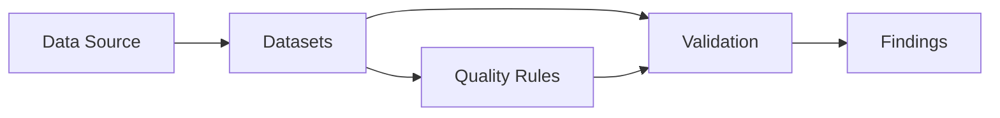
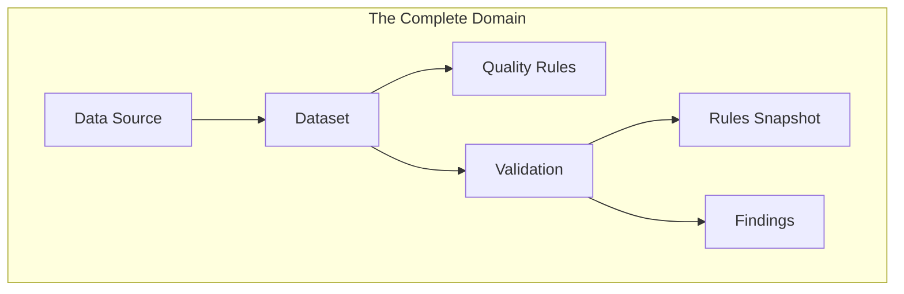

# Data Quality Platform: System Design Context

## 1. Core Objectives & Goals

*   **Detect Problems:**
    *   Identify *what* failed.
    *   Identify *where* it failed.
    *   Quantity: *How many records failed?*
    *   Timeline: *When* it happened.
*   **Measure Quality:**
    *   The platform should produce metrics that summarize the overall health of a dataset.
*   **Track Quality Over Time:**
    *   Quality is not just today's results.
    *   *Is the data improving?*
    *   *Did quality drop after deployment?*
    *   *Which datasets are becoming unreliable?*
*   **Notify Stakeholders:**
    *   The appropriate people should be notified immediately when quality drops.
*   **Provide Visibility:**
    *   Different users require different views of the data:
        *   **Data Engineers:** Technical views (e.g., raw logs, execution details).
        *   **Managers:** Overall quality indicators.
        *   **Executives:** Trends and high-level insights.
*   **Build Trust:**
    *   Before someone utilizes the datasets, they must trust the data first.

> **Ultimate Mission:** *"Continuously assess, measure, monitor and communicate the trustworthiness of an organization's data."*

---

## 2. Domain & Process Identifications

*   **Stakeholders:**
    *   Data Engineer, Data Scientist, Data Analyst, Data Steward, Business User, Manager.
*   **Data Quality Dimensions:**
    *   Completeness, Validity, Consistency, Uniqueness, Timeliness, Accuracy, Business Context.
*   **The Validation Workflow:**
    1.  Someone defines **Expectations** (Business Rules).
    2.  The **Platform** evaluates the data against those rules.
    3.  **Results** are produced.
    4.  Someone **reviews** the results.
    5.  **Actions** are taken *outside* the platform based on the findings.

---

## 3. Key Functionalities

### A. Quality Measurement
*   **How should the quality be expressed?**
    *   Number of violations.
    *   Percentage of valid records.
    *   Overall dataset health.
    *   Trends over time.
*   **Goal:** These metrics help users understand the state of their data.

### B. Actions After Validations
*   **What happens when bad data is found?**
    *   Ignore it?
    *   Investigate it?
    *   Assign it to someone?
    *   Notify responsible teams?
    *   Fix the Source System.
*   **Platform Responsibility:** To provide visibility into the problem. (The platform is an observer and logger, not the primary fixer).

---

## 4. Domain Vocabulary

*   **Data Source:** Where the data comes from.
*   **Dataset:** What is being evaluated.
*   **Quality Rule:** Defines the expected quality of the dataset.
*   **Validation:** The act of validating data against rules (recorded as an event).
*   **Finding:** Detailed data about a specific deviation from a rule.
*   **Quality Metrics:** Measures one specific aspect of quality.
*   **Quality Score:** Summarizes the overall quality of a dataset.
*   **Report:** Presents validation results and metrics.
*   **Notification:** Alerts stakeholders to changes or issues.

---

## 5. MVP: Main Entities & Business Flow

### Main Entities
*   **Data Source**
*   **Dataset**
*   **Quality Rules**
*   **Validation**
*   **Findings**
*   **User**
*   **Notification**

### The Business Flow


---

## 6. Detailed Entity Definitions

### 6.1 Data Source
*   **Definition:** Where the organization's data is located. Responsible for representing a logical source of data.
*   **Information:**
    *   Name, Type, Description, Status, Owner, Registration Date.
*   **Actions:**
    *   Be registered, renamed, enabled, disabled, archived.
    *   Discover available datasets.
    *   Refresh Data Catalog.
*   **Business Rules:**
    *   Every Data Source must have a unique identity and name.
    *   A disabled Data Source cannot be validated.
    *   An archived Data Source cannot be modified.
*   **Relationship:**
    *   A Data Source contains many Datasets.
*   **Life Cycle:**
    ```mermaid
    graph LR
        Registered --> Active
        Active --> Disabled
        Disabled --> Active
        Active --> Archived
    ```

### 6.2 Dataset
*   **Definition:** Represents a collection of business data whose quality can be evaluated. It represents a business data asset.
*   **Information:**
    *   Name, Description, Type, Status, Last Discovered, Last Validated, Domain, Tags, Criticality.
*   **Behavior:**
    *   Be discovered, renamed, enabled, disabled, archived.
    *   Refresh Metadata.
    *   Accept or remove quality rules.
    *   Start a validation process.
*   **Business Rules:**
    *   Must belong to **one** and only one Data Source.
    *   Cannot exist without a Data Source.
    *   May have zero or many Quality Rules.
    *   May have zero or many Validations.
    *   May be validated multiple times over its lifetime.
    *   Cannot be modified after being archived.
*   **Relationships:**
    *   **Dataset → Data Source:** Belongs to one Data Source.
    *   **Dataset → Quality Rules:** Dataset owns the Quality Rules that define its quality.
    *   **Dataset → Validation:** Dataset has many validations.

### 6.3 Quality Rule
*   **Definition:** A quality rule is an assertion or expectation about a Dataset. It defines what "Good Data" means. *Note: The platform is not aware of the business logic; it simply stores and executes the rule.*
*   **Information:**
    *   Name, Description, Category, Severity, Expectation, Status, Target, Condition, Last Executed.
*   **Actions:**
    *   Be enabled, disabled, archived, renamed, or change severity.
*   **Business Rules:**
    *   Must belong to exactly **one** dataset.
    *   Must define exactly **one** expectation.
    *   Must have a Category and a Severity.
    *   Cannot exist without a Target.
    *   Cannot be executed if Disabled.
*   **Relationships:**
    *   **Quality Rule → Dataset:** Belongs to one dataset.
    *   **Validation → Quality Rule:** A Validation evaluates many rules.
    *   **Quality Rule → Finding:** A finding originates from one specific rule.

### 6.4 Validation
*   **Definition:** It is the process and record of evaluation of a Dataset at a specific point in time.
*   **Questions Answered:**
    *   When was this dataset last checked?
    *   Which rules were evaluated?
    *   How long did it take?
    *   Was it successful?
    *   How many issues were found?
    *   What was the Quality Score yesterday?
    *   Did the quality improve this week?
*   **Responsibility:**
    *   Representing one quality assessment of a Dataset.
    *   Recording when it happened, what was evaluated, and the outcomes.
    *   Linking to the findings it produced.
*   **Information:**
    *   ID, DatasetID, Trigger, Status.
*   **Business Rules:**
    *   Validation belongs to exactly **one** dataset.
    *   Validation has exactly **one** trigger.
    *   Validation has exactly **one** status.
    *   A Completed Validation cannot be modified.
    *   Findings always belong to a specific Validation.
    *   A Validation evaluates a **fixed set of Rules (snapshot)**.
*   **Relationships:**
    *   **Dataset → Validation:** Datasets have many validations.
    *   **Validation → Findings:** Validation produces findings.

---

## 7. The Complete Domain Model



---

## 8. Proposed Technical Architecture

*   **Primary Language & Framework:**
    *   Java with Spring Boot.
*   **Architecture Style:**
    *   Modular Monolith.
*   **Communication:**
    *   gRPC Communication.
*   **Database & Persistence:**
    *   Postgres with Flyway (for migrations).
    *   Data JPA / Hibernate (for ORM).
