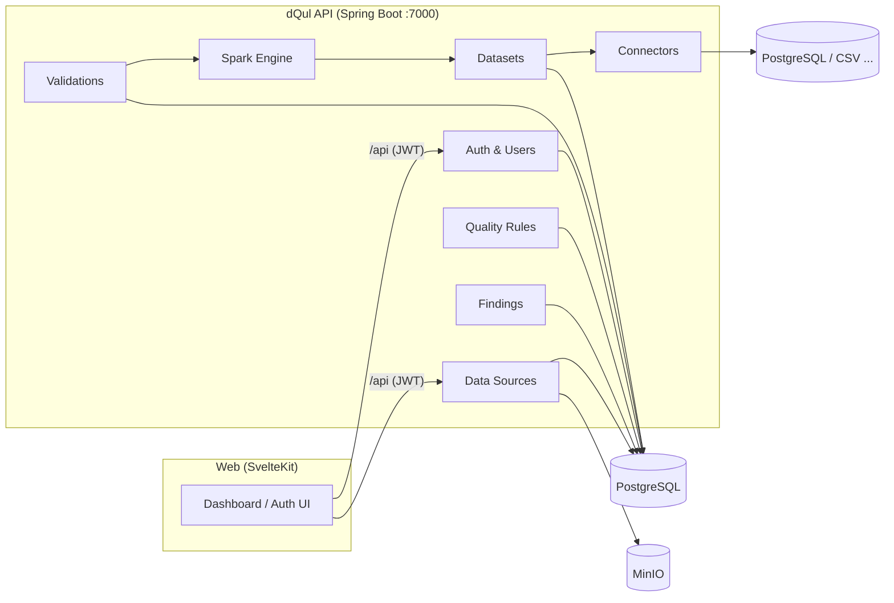
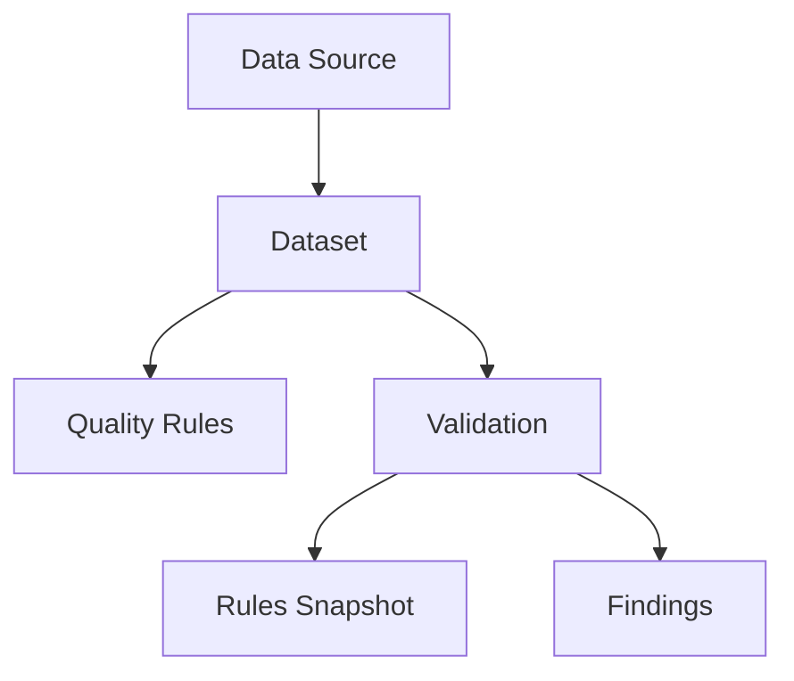

# Data Quality Platform (dQul)

> **Continuously assess, measure, monitor and communicate the trustworthiness of an organization's data.**

The Data Quality Platform is an end-to-end system for defining data quality expectations, validating datasets against those expectations, tracking quality over time, and giving stakeholders visibility into the health of their data.

## Why dQul?

Data quality issues are expensive and hard to spot. This platform helps you:

- **Detect problems** — what failed, where it failed, how many records failed, and when.
- **Measure quality** — produce metrics that summarize the overall health of a dataset.
- **Track quality over time** — is the data improving? Did quality drop after a deployment?
- **Notify stakeholders** — alert the right people the moment quality drops.
- **Provide visibility** — tailored views for data engineers, managers, and executives.
- **Build trust** — so people can rely on the data before they use it.

## Features

- **Data Sources & Datasets** — register logical data sources (PostgreSQL, CSV, …), discover their datasets, and refresh metadata.
- **Pluggable Connectors** — a common `DataSourceConnector` interface with ready-made PostgreSQL and CSV implementations (extensible to MySQL, MongoDB, Parquet, Iceberg, …).
- **Quality Rules** — assert what "good data" means per dataset: category, severity, expectation, and target.
- **Validation Engine** — evaluate a dataset against a fixed snapshot of rules, recording each run (trigger, status, findings).
- **Findings** — detailed deviations produced by a validation run.
- **Spark-powered Compute** — embedded Apache Spark engine for data profiling and large-scale computation.
- **Authentication & Authorization** — JWT-based auth with Spring Security (register, login, token verification, role-based access).
- **Object Storage** — MinIO integration for storing files (e.g., raw uploads, reports).
- **Modern UI** — SvelteKit dashboard with dark mode, data tables, and chat-driven exploration.

## Architecture

The platform follows a **modular monolith** design (Java/Spring Boot backend) with a separate SvelteKit frontend, backed by PostgreSQL, MinIO, and an embedded Spark engine.



### Domain model



### The validation workflow

1. Someone defines **Expectations** (business rules) on a dataset.
2. The **Platform** evaluates the data against those rules.
3. **Results** (validations + findings) are produced.
4. Someone **reviews** the results.
5. **Actions** are taken outside the platform based on the findings.

> The platform is an **observer and logger** — it provides visibility into problems, not the primary fixer.

## Tech Stack

| Layer | Technology |
|-------|-----------|
| Backend | Java 21, Spring Boot 4.1.0, Spring Data JPA, Spring Security, Flyway |
| Compute | Apache Spark 3.5.5 (Scala 2.13), ANTLR |
| Frontend | SvelteKit 5, Svelte 5 (runes), TypeScript, Tailwind CSS 4, shadcn-svelte / bits-ui |
| Database | PostgreSQL 16 (H2 for tests), Flyway migrations |
| Object Storage | MinIO |
| Auth | JWT (jjwt 0.12.6) |
| Build | Maven (backend), Vite (frontend) |
| Infra | Docker Compose |

## Repository Structure

```
Data-Quality-Platform/
├── dQul/                      # Backend — Spring Boot application (port 7000)
│   ├── src/main/java/com/regisx001/dQul/
│   │   ├── authentication/    # Register / login / verify / me
│   │   ├── common/            # User entity, user management
│   │   ├── connector/         # DataSourceConnector SPI + Postgres/CSV impls
│   │   ├── compute/spark/     # Embedded Spark session & demo endpoints
│   │   ├── dataset/           # Datasets, columns, column profiles
│   │   ├── datasource/        # Data sources CRUD & discovery
│   │   ├── notification/      # Notification domain
│   │   ├── rules/             # Quality rules (category / severity)
│   │   ├── security/          # JWT filter, security config, JWT service
│   │   ├── storage/minio/     # MinIO object storage config
│   │   └── validation/        # Validations, rule snapshots, findings
│   └── src/main/resources/
│       ├── application.yaml   # Config (env-driven)
│       └── db/migration/      # Flyway migrations (V1–V5)
├── web/                       # Frontend — SvelteKit app
│   └── src/
│       ├── lib/               # Components, server API clients, stores
│       └── routes/            # login, signup, logout, (dashboard), (chat)
├── docs/
│   ├── api-docs.md            # REST API reference
│   └── POV.md                 # Microservices point-of-view
├── CONTEXT.md                 # System design & domain model
├── docker-compose.yaml        # Postgres, MinIO (Spark optional)
└── .env.example               # Environment template
```

## Getting Started

### Prerequisites

- **Java 21** (JDK)
- **Node.js** (>= 20) and a package manager (`npm`)
- **Docker** + **Docker Compose**
- Maven wrapper is included in `dQul/` (no global Maven install required)

### 1. Environment setup

Create your environment file and link it to the backend so the application can resolve `DATABASE_URL`, `JWT_SECRET_KEY`, `MINIO_*`, and `SPARK_*` settings:

```sh
# create .env file
cp .env.example .env

# create the symlink for the env
ln -s "$(pwd)/.env" dQul/.env
```

> The backend reads env vars from `dQul/.env`; keep the symlink in place or your values won't be picked up.

### 2. Start infrastructure

```sh
docker compose up -d
```

This starts:

- **PostgreSQL 16** — exposed on port `3452` (database `dqul`, user/pass `postgres`/`postgres` by default)
- **MinIO** — API on `21001`, console on `21002` (default `minioadmin`/`minioadmin123`)

Spark master/worker services are available in `docker-compose.yaml` but **commented out** — the backend runs Spark in embedded `local[*]` mode by default.

### 3. Run the backend

```sh
cd dQul
./mvnw spring-boot:run
```

Or use the provided script (sources `../.env` for you):

```sh
cd dQul
./run.sh
```

The API will be available at `http://localhost:7000`.

### 4. Run the frontend

```sh
cd web
npm install
npm run dev
```

Open the dev server (default `http://localhost:5173`). The Vite dev server proxies `/api` requests to `http://localhost:7000`.

## Environment Variables

All configuration is externalized. See `.env.example` for the full list. Key variables:

| Variable | Default | Description |
|----------|---------|-------------|
| `DATABASE_URL` | `jdbc:postgresql://localhost:3452/dqul` | JDBC connection string |
| `DATABASE_USERNAME` / `DATABASE_PASSWORD` | `postgres` / `postgres` | DB credentials |
| `JWT_SECRET_KEY` | (sample key) | Secret for signing JWTs — **change in production** |
| `JWT_EXPIRATION_TIME` | `86400000` | Token TTL (ms) |
| `MINIO_ENDPOINT` / `MINIO_ROOT_USER` / `MINIO_ROOT_PASSWORD` | `http://localhost:21001` / `minioadmin` / `minioadmin123` | MinIO connection |
| `SPARK_MASTER` | `local[*]` | `spark://localhost:7077` for the standalone cluster |
| `SPARK_ENABLED` | `true` | Enable the embedded Spark session |

## API Overview

Base URL: `http://localhost:7000` — Authentication via `Authorization: Bearer <token>`.

| Area | Endpoints |
|------|-----------|
| Auth (public) | `POST /api/v1/auth/register`, `POST /api/v1/auth/login`, `POST /api/v1/auth/verify`, `GET /api/v1/auth/me` |
| Users | `GET/PUT/DELETE /api/v1/users…`, `PATCH /api/v1/users/{id}/activate\|deactivate` |
| Data Sources | Datasource CRUD, status, config, connection test, dataset discovery/import |
| Datasets | Dataset details, columns, column profiles, data preview |
| Compute | Spark demo endpoints |

> Full request/response contracts and error formats: **[`docs/api-docs.md`](docs/api-docs.md)**.

## Testing

Run the backend test suite (JUnit / Spring Boot Test):

```sh
cd dQul
./mvnw test
```

Tests cover authentication, user management, JWT, security filters, connectors (CSV/Postgres), Spark providers, and the domain model.

## Docker

Dockerfiles exist at `dQul/Dockerfile` and `web/Dockerfile` for containerizing the backend and frontend respectively, alongside the infrastructure services in `docker-compose.yaml`.

## Documentation

- **[`CONTEXT.md`](CONTEXT.md)** — Goals, domain vocabulary, entities, and the complete data model.
- **[`docs/api-docs.md`](docs/api-docs.md)** — REST API reference with examples and error responses.
- **[`docs/POV.md`](docs/POV.md)** — A microservices-oriented design point of view for future evolution.

## Roadmap

Built around the core domain entities — **Data Source → Dataset → Quality Rules → Validation → Findings** — the platform is designed to grow toward scheduled validations, profiling, alerting, and richer notifications. See `docs/POV.md` for a phased service breakdown.