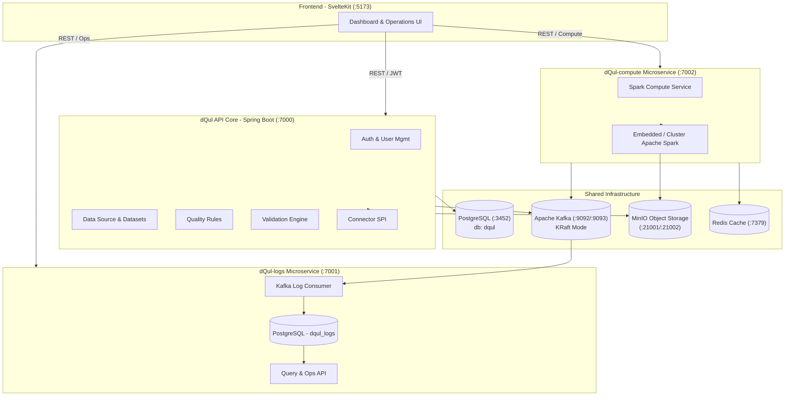
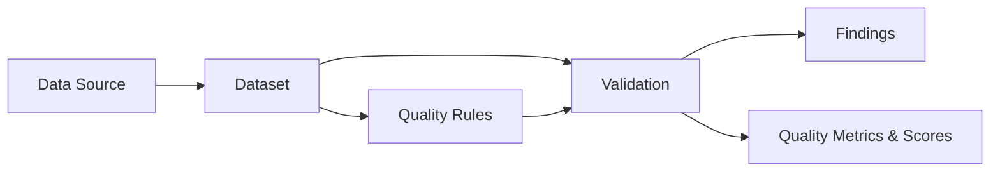

# Data Quality Platform (dQul)

> **Continuously assess, measure, monitor, and communicate the trustworthiness of an organization's data.**

The **Data Quality Platform (dQul)** is an enterprise-grade, end-to-end system for defining data quality expectations, running high-performance automated validations against datasets, profiling data, tracking health trends over time, and offering full real-time visibility and alerting for data stakeholders.

---

## Why dQul?

Data quality issues cost organizations millions in bad decisions, silent pipeline corruptions, and broken downstream reports. dQul helps teams solve this by providing:

- **Problem Detection** — Identify *what* failed, *where* it failed, *how many records* failed, and *when* it occurred.
- **Quality Measurement** — Generate standard metrics, scores, and indicators summarizing overall dataset health.
- **Trend Tracking** — Track health metrics over time to determine if data quality is improving or if a recent deployment caused regressions.
- **Instant Stakeholder Alerts** — Automatically notify engineering, operations, and business teams when data health drops below defined thresholds.
- **Tailored Visibility** — Dedicated, role-appropriate dashboards for Data Engineers (raw logs & execution metrics), Managers (health indicators & SLAs), and Executives (high-level quality trends).
- **Data Trust** — Establish confidence before data reaches downstream analytics, ML pipelines, or production data warehouses.

---

## Key Features

- **Data Sources & Dataset Management** — Register logical data sources (PostgreSQL, CSV files, S3/MinIO objects, etc.), auto-discover datasets, and sync schema metadata.
- **Pluggable Connector Architecture** — Unified `DataSourceConnector` SPI with built-in PostgreSQL and CSV implementations, designed to easily extend to MySQL, MongoDB, Parquet, and Iceberg.
- **Flexible Quality Rules** — Express precise expectations per dataset across standard data quality dimensions (Completeness, Validity, Uniqueness, Consistency, Timeliness, Accuracy).
- **Automated Validation Engine** — Evaluate datasets against rule snapshots, producing structured validation run history, metrics, and actionable findings.
- **Spark-Powered Compute Service (`dQul-compute`)** — Dedicated microservice leveraging Apache Spark for high-throughput distributed profiling, large-scale SQL query evaluation, and rule execution.
- **Native Event-Driven Logging (`dQul-logs`)** — Standalone log ingestion microservice that captures platform log events over Kafka, stores them in PostgreSQL, and offers ops APIs, querying, and automatic retention purges.
- **Security & Access Control** — Production-ready JWT authentication with Spring Security, user activation controls, and role-based access.
- **Object Storage Integration** — MinIO / S3 integration for managing raw data files, uploads, profiling artifacts, and reports.
- **Modern Web UI (`web`)** — Sleek SvelteKit 5 dashboard built with Tailwind CSS 4, shadcn-svelte UI components, dark mode support, interactive data tables, and chat-driven exploration.

---

## Architecture & Domain Model

### System Architecture

The platform combines a **modular core application** with **decoupled microservices** for logs and heavy compute workloads, communicating via REST APIs, Kafka event streams, and shared cache/storage infrastructure.



### Domain Business Flow

The platform follows a clear domain lifecycle: **Data Source → Dataset → Quality Rules → Validation → Findings**.



1. **Expectations Definition**: Users define business rules & thresholds for a target dataset.
2. **Validation Execution**: The Validation Engine (or Compute Service) executes checks against raw data.
3. **Findings & Metrics Generation**: Rule violations are saved as `Findings` while overall pass rates produce `Quality Metrics`.
4. **Observation & Alerting**: Results are displayed in the dashboard and exported/streamed for stakeholder notification.

> *Note: dQul acts as an **observer and reporter**. It detects, quantifies, and alerts on data quality degradation without silently mutating source data.*

---

## Tech Stack

| Domain | Technologies |
|--------|--------------|
| **Core Backend (`dQul`)** | Java 21, Spring Boot 4.1.0, Spring Data JPA, Spring Security, Flyway, JWT (jjwt) |
| **Compute Microservice (`dQul-compute`)** | Java 21, Spring Boot 3.4.2, Apache Spark 3.5.5, Spring Kafka, Redis Cache |
| **Logs Microservice (`dQul-logs`)** | Java 21, Spring Boot 3.4.2, Spring Data JPA, Apache Kafka, Flyway, Swagger/OpenAPI |
| **Frontend (`web`)** | SvelteKit 5, Svelte 5 (Runes), TypeScript, Tailwind CSS 4, shadcn-svelte / bits-ui |
| **Database & Cache** | PostgreSQL 16, Redis 7.4 |
| **Messaging & Storage** | Apache Kafka 3.8 (KRaft mode), MinIO (S3-compatible object storage) |
| **Build & Tooling** | Maven (`./mvnw`), Vite, Docker & Docker Compose |

---

## Repository Structure

```
Data-Quality-Platform/
├── dQul/                      # Core Backend API Service (Port 7000)
│   ├── src/main/java/         # Auth, DataSources, Datasets, Quality Rules, Validations
│   ├── src/main/resources/    # application.yaml, Flyway migrations (V1-V5)
│   ├── Dockerfile             # Core service container specs
│   └── run.sh                 # Convenient launch script (loads root .env)
├── dQul-compute/              # Spark Compute Microservice (Port 7002)
│   ├── src/main/java/         # Spark session, dataset profiler, Kafka consumers/producers
│   ├── docs/                  # Spark wiring guide & topic contracts
│   └── run.sh                 # Service launch script
├── dQul-logs/                 # Kafka Log Ingestion Microservice (Port 7001)
│   ├── src/main/java/         # Kafka consumer, log repository, read/purge REST controllers
│   ├── docs/                  # Kafka topic contract & log schema documentation
│   └── run.sh                 # Service launch script
├── web/                       # Frontend SvelteKit Application (Port 5173)
│   ├── src/lib/               # Reusable UI components, stores, API clients
│   └── src/routes/            # Pages: Login, Register, Dashboard, Dataset Explorer, Chat
├── docs/                      # General system documentation (API Reference, POV design)
├── docker-compose.yaml        # Infrastructure services (PostgreSQL, Kafka, MinIO, Redis, Spark)
├── Dockerfile.spark           # Custom Spark Dockerfile with S3/MinIO connectors
└── .env.example               # Central environment variable template
```

---

## Getting Started

### Prerequisites

Ensure you have the following installed on your host system:

- **JDK 21** or later
- **Node.js** (v20+) and `npm`
- **Docker** and **Docker Compose**
- *(Optional)* Git

---

### Step 1: Environment Setup

Create your environment configuration from the provided template and link it to the services:

```bash
# Clone the repository (if not already done)
git clone https://github.com/regisx001/Data-Quality-Platform.git
cd Data-Quality-Platform

# Create root environment file
cp .env.example .env

# Symlink .env into backend module so local launches pick up variables
ln -s "$(pwd)/.env" dQul/.env
```

---

### Step 2: Start Infrastructure Services

Spin up PostgreSQL, MinIO, Kafka, and Redis using Docker Compose:

```bash
docker compose up -d dqul-postgres minio kafka redis
```

This starts:
- **PostgreSQL 16** on port `3452` (`dqul` and `dqul_logs` databases)
- **MinIO API** on port `21001` & **Console** on `http://localhost:21002` (`minioadmin` / `minioadmin123`)
- **Apache Kafka 3.8** on internal port `9092` & host listener port `9093`
- **Redis 7.4** on port `7379`

*(Optional)* You can also launch Kafka UI on port `24001` or the standalone Spark cluster by uncommenting them in `docker-compose.yaml` or running `docker compose up -d`.

---

### Step 3: Run the Services

You can run the microservices independently using their Maven wrappers.

#### 1. Core Backend (`dQul`)
```bash
cd dQul
./mvnw spring-boot:run
# Or use: ./run.sh
```
> **API Endpoint:** `http://localhost:7000` | **Swagger Docs:** `http://localhost:7000/swagger-ui.html`

#### 2. Logs Microservice (`dQul-logs`) — *Optional*
```bash
cd dQul-logs
./mvnw spring-boot:run
# Or use: ./run.sh
```
> **Logs API:** `http://localhost:7001/api/v1/logs` | **Swagger Docs:** `http://localhost:7001/swagger-ui.html`

#### 3. Compute Microservice (`dQul-compute`) — *Optional*
```bash
cd dQul-compute
./mvnw spring-boot:run
# Or use: ./run.sh
```
> **Compute API:** `http://localhost:7002/api/v1/compute` | **Swagger Docs:** `http://localhost:7002/swagger-ui.html`

#### 4. Frontend Application (`web`)
```bash
cd web
npm install
npm run dev
```
> **Web Dashboard:** `http://localhost:5173` *(Vite automatically proxies `/api` requests to port `7000`)*

---

## Environment Variables Summary

Configuration details are loaded from `.env`. Key parameters:

| Variable | Default Value | Description |
|----------|---------------|-------------|
| `DQUL_DATABASE_URL` | `jdbc:postgresql://localhost:3452/dqul` | Core Backend Database JDBC URL |
| `DQUL_LOGS_DATABASE_URL` | `jdbc:postgresql://localhost:3452/dqul_logs` | Logs Service Database JDBC URL |
| `KAFKA_BOOTSTRAP_SERVERS` | `localhost:9093` | Kafka Broker Host Port |
| `REDIS_HOST` / `REDIS_PORT` | `localhost` / `7379` | Redis Host & Port |
| `JWT_SECRET_KEY` | *(Secret Base64 String)* | Key for signing user authentication tokens |
| `MINIO_ENDPOINT` | `http://localhost:21001` | S3 / MinIO API URL |
| `SPARK_MASTER` | `spark://localhost:7077` / `local[*]` | Spark Master URL |
| `SERVER_PORT` | `7000` / `7001` / `7002` | Port mapping per microservice |

---

## Testing

Run automated unit and integration tests across the platform:

```bash
# Core Backend Tests
cd dQul && ./mvnw test

# Logs Microservice Tests
cd dQul-logs && ./mvnw test

# Compute Microservice Tests
cd dQul-compute && ./mvnw test

# Web Frontend Tests & Checks
cd web && npm run check
```

---

## Related Documentation

- **[`CONTEXT.md`](CONTEXT.md)** — Architectural design, domain definitions, and complete entity structures.
- **[`docs/api-docs.md`](docs/api-docs.md)** — Comprehensive REST API documentation for core backend services.
- **[`docs/POV.md`](docs/POV.md)** — Architectural evolution roadmap and microservices point of view.
- **[`dQul-logs/docs/topic-contract.md`](dQul-logs/docs/topic-contract.md)** — Kafka log event contracts and schema definitions.
- **[`dQul-compute/docs/spark-wiring-guide.md`](dQul-compute/docs/spark-wiring-guide.md)** — Spark engine integration details.