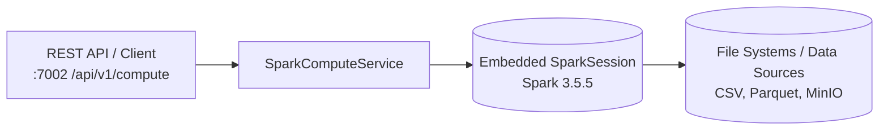

# dQul-compute

Compute microservice for the Data Quality Platform — a Spring Boot 3.4.2 / Java 21 service that embeds an **Apache Spark 3.5.5** session to perform high-performance data processing, profiling, and quality validation jobs.

> **Standalone Microservice**
> This service runs independently on port `7002` and provides high-throughput compute capabilities without direct database dependencies (PostgreSQL removed). It connects to shared platform infrastructure like Redis and Kafka.

## Architecture



- **Spark Integration:** Embedded `SparkSession` configured via Spring properties (`SparkProperties`).
- **Stateless & Scalable:** Compute service maintains no relational DB state, making it light and easily horizontally scalable.
- **REST Endpoints:** Endpoint `/api/v1/compute/jobs` accepts compute requests (SQL queries or dataset files) and yields execution metrics & preview rows.

## Requirements

- JDK 21
- Maven (or `./mvnw` wrapper)

## Running Locally

From the repository root:

```bash
cd dQul-compute
./mvnw spring-boot:run
```

The REST API is available at `http://localhost:7002/api/v1/compute` and OpenAPI documentation at `http://localhost:7002/swagger-ui.html`.

## Endpoints

| Method | Path | Description |
|--------|------|-------------|
| GET | `/api/v1/compute/health` | Check compute service status and Spark version |
| POST | `/api/v1/compute/jobs` | Submit a Spark compute job |

## Configuration

| Environment Variable | Default | Description |
|----------------------|---------|-------------|
| `SERVER_PORT` | `7002` | HTTP port |
| `SPARK_MASTER` | `local[*]` | Spark master URL |
| `SPARK_APP_NAME` | `dQul-compute-service` | Application name in Spark context |
| `SPARK_DRIVER_HOST` | `127.0.0.1` | Spark driver host |
| `SPARK_DRIVER_MEMORY` | `1g` | Spark driver memory |
| `SPARK_EXECUTOR_MEMORY` | `1g` | Spark executor memory |
