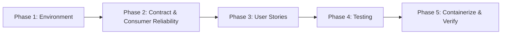

# dQul-logs — MVP Implementation Plan

> **Scope boundary:** This plan covers the **standalone `dQul-logs` microservice** only.
> It is intentionally **NOT wired into the main `dQul` application** (no module dependency,
> no shared config, no changes to the root `docker-compose.yaml`, `web/`, or `dQul/`).

---

## 1. Summary

`dQul-logs` is a Spring Boot 3.4.2 / Java 21 microservice that **ingests log events natively
over Kafka**, persists them to PostgreSQL, and exposes a read/ops-only REST API for querying,
stats, and retention purge.

**Architecture decision (this revision): ingestion is Kafka-first, not HTTP-first.**
`dQul-logs` is an internal tool for the platform's own logs — adding HTTP overhead per event is
unnecessary. Internal producers (the platform's services) publish log events **directly** to the
`platform-logs-topic` topic (key = `traceId`); the microservice consumes those events and stores
them. The REST API has **no write endpoints in the MVP** (query, get-by-id, stats, purge only).
HTTP log ingestion is deferred to a **post-MVP hybrid phase** where an HTTP path can be added
for external clients without touching the internal Kafka path.

Because the HTTP boundary no longer validates payloads, **validation, normalization, and
poison-message handling move to the consume side**, and the **topic message contract** becomes a
first-class deliverable so producers know exactly what to emit.

Much of the scaffold already exists. This plan:
1. Audits the current state and flags the gaps that block a runnable MVP.
2. Defines the **MVP scope** (in/out), including the deferred HTTP (hybrid) path.
3. Breaks the work into **5 phases → tasks** (T001…T026), each immediately executable.
4. Provides a **Requirement Mapping** table for traceability.

**Target outcome:** a microservice that runs 100% standalone via its own
`docker-compose.yaml` + `Dockerfile`, ingests over Kafka end-to-end (produce → consume →
persist → query), validates and dead-letters bad messages, and ships a documented topic
contract — with zero coupling to the main app and **zero HTTP overhead on the write path**.

---

## 2. Current State Assessment

| Area | Status | Notes |
|------|--------|-------|
| Spring Boot app entry point | ✅ Done | `LogsApplication.java` |
| `LogEntry` JPA entity + indexes | ✅ Done | `domain/LogEntry.java`, Flyway `V1__create_log_entries_table.sql` |
| Repository (JPA + Specifications) | ✅ Done | `repository/LogEntryRepository.java` |
| Service layer (save/query/stats/purge) | ✅ Done | `service/LogService.java` |
| REST **read** endpoints (query/get/stats/purge) | ✅ Done | `controller/LogController.java` |
| REST **ingest** endpoint | ⚠️ Deferred | `POST /api/v1/logs/ingest` + `KafkaTemplate` — disable for MVP, re-add in hybrid phase |
| Kafka topic + consumer | ✅ Done | `config/KafkaConfig.java`, `kafka/KafkaLogConsumer.java` |
| Consumer JSON deserialization | ✅ Done | `spring.json.trusted.packages` set in `application.yaml` |
| **Topic message contract** | ❌ Missing | Producers need a documented schema to emit compatible events |
| Consume-time validation/normalization | ❌ Missing | No HTTP gate anymore → must happen on consume |
| Poison-message / dead-letter handling | ❌ Missing | Bad JSON currently logs+skips; needs a DLT |
| API error handling (read endpoints) | ❌ Missing | No `@RestControllerAdvice`; inconsistent error bodies (e.g. bare 404) |
| API docs | ❌ Missing | No OpenAPI/Swagger |
| Tests | ⚠️ Minimal | Only `contextLoads()`; no unit/consumer/controller tests |
| Standalone run env | ❌ Missing | No `docker-compose.yaml`, no `Dockerfile`, `run.sh` depends on root `../.env` |
| README / env docs | ❌ Missing | No service-level README |

### Critical blockers (new, Kafka-first)
With ingestion now Kafka-native, the original producer-serializer blocker is gone (no HTTP
ingest → no `KafkaTemplate` producer inside this service). The new blockers are:
1. **No message contract** — producers don't know the event schema for `platform-logs-topic`
   (field names/types, key = `traceId`, JSON envelope). Until `topic-contract.md` exists and the
   consumer's deserializer matches it, nothing interoperable flows. (Task T005.)
2. **No consume-side validation** — with the HTTP gate removed, malformed events arrive on the
   topic; the consumer must validate/normalize before persisting. (Task T007.)
3. **No dead-letter handling** — poison messages (bad JSON, invalid fields) must route to
   `platform-logs-topic.DLT`, not be silently dropped or retried forever. (Task T008.)

---

## 3. MVP Scope

### In scope (MVP)
- **Kafka-native log ingestion** — internal producers publish events to `platform-logs-topic`
  (key = `traceId`); `KafkaLogConsumer` persists them. **No HTTP on the write path.**
- **Documented topic message contract** for producers.
- **Consume-time validation + normalization** (level/category whitelist, defaults, reject empty).
- **Dead-letter topic** for poison messages (`platform-logs-topic.DLT`).
- Durable persistence to PostgreSQL (Flyway-managed schema).
- **Read/ops REST API:** query (filters + pagination), get-by-id, stats, purge.
- Consistent API error responses on the read API.
- Standalone local environment (own compose + Dockerfile + env docs).
- Tests for the core paths.

### Out of scope (post-MVP / deferred)
- **HTTP log ingestion (hybrid)** — `POST /api/v1/logs/ingest` is deferred to a post-MVP phase
  (kept out of the MVP surface; re-added later with HTTP-boundary validation, without touching
  the internal Kafka path).
- Wiring into the main `dQul` app, `web/` frontend, or root compose.
- Authentication/authorization of the logs API.
- Exactly-once / idempotent dedup (Kafka is at-least-once → MVP accepts rare duplicates).
- Centralized observability/metrics exporters (Prometheus/Grafana).
- Multi-tenant isolation, partitioning/archiving, audit/RBAC.

---

## 4. Technical Context

- **Language/Runtime:** Java 21, Spring Boot 3.4.2, Maven (wrapper `mvnw`).
- **Persistence:** PostgreSQL 16, Spring Data JPA/Hibernate (`ddl-auto: validate`), Flyway.
- **Messaging (ingestion path):** Apache Kafka (KRaft mode, no ZooKeeper). Topic
  `platform-logs-topic` (3 partitions, replication 1). **Key = `traceId`** (partitioning +
  ordering per trace). **Value = JSON event** (the `LogIngestionDto` shape). At-least-once
  delivery semantics.
- **Read API:** REST on port `7001` (`/api/v1/logs`) — **no write endpoints in the MVP**.
- **Data model:** single table `log_entries` with indexes on `trace_id`, `service_name`,
  `log_level`, `timestamp`, `category`.
- **Config:** env-var driven with sensible defaults (`application.yaml`).

---

## 5. Applied Guidelines

Source: `guidelines/spring-boot-scaffolding` + Kafka messaging best practices

- Use **JDK 21** for new Spring Boot services (LTS until 2031). ✅ already on 21.
- Keep Flyway migrations as the **single source of truth** for schema (`ddl-auto: validate`).
- Use **Lombok** to reduce boilerplate. ✅ already used.
- Prefer a **multi-stage Dockerfile** for the OCI image (build with Maven, runtime on Temurin 21).
- **Kafka:** keep producer/consumer serialization symmetric — document the JSON schema once and
  treat it as the contract; set `spring.json.trusted.packages` / default type so both ends agree.
- **Kafka:** name dead-letter topics `<original-topic>.DLT` and use a
  `DeadLetterPublishingRecoverer` so a poison message never kills the consumer.
- **No HTTP boundary → validate at the consume boundary** (whitelist, defaults, reject).
- Keep API responses consistent via a **global exception handler** and documented OpenAPI contract.

---

## 6. Implementation Steps (Phases)

### Phase 1 — Standalone Environment (Setup)
Prepares the service to run fully on its own.

- **1.1** Add missing dependencies to `pom.xml` (validation, actuator, OpenAPI).
- **1.2** Add a standalone `docker-compose.yaml` inside `dQul-logs` (Kafka + Postgres).
- **1.3** Add `.env.example` documenting all service env vars.
- **1.4** Add service `README.md`; make `run.sh` self-contained (no root `.env` dependency).

### Phase 2 — Foundational: Contract & Consumer Reliability (Blocking prerequisites)
Makes Kafka-native ingestion actually work and fail cleanly.

- **2.1** Define the **topic message contract** (`topic-contract.md`) + reference producer snippet.
- **2.2** Remove/disable the deferred **HTTP ingest endpoint** from the controller for the MVP.
- **2.3** Add **consume-time validation & normalization** in the consumer/service.
- **2.4** Add **dead-letter handling** (`platform-logs-topic.DLT`).
- **2.5** Verify **symmetric JSON config** (consumer deserializer ↔ contract).

### Phase 3 — MVP User Stories (features)
Verify + harden the feature set, adding tests as we go.

- **US1** — Kafka-native ingestion → persist → `REQ-001`, `REQ-002`
- **US2** — Consume-time validation + DLT → `REQ-007`, `REQ-008`
- **US3** — Query/filter/search logs (paginated) → `REQ-003`
- **US4** — Fetch single log by id → `REQ-004`
- **US5** — Aggregate stats → `REQ-005`
- **US6** — Purge logs older than N days → `REQ-006`
- **US7** — Read-API polish: consistent error envelope + OpenAPI docs → `REQ-003…REQ-006` quality

### Phase 4 — Testing
- **4.1** Service unit tests (mocked repository) incl. validation/normalization.
- **4.2** Consumer tests (`@EmbeddedKafka`): valid → persisted; invalid → DLT.
- **4.3** Read-API controller tests (MockMvc), incl. error envelope.
- **4.4** Integration test (Testcontainers Postgres+Kafka, or H2 profile) covering
  produce → consume → query round trip + Flyway migration.

### Phase 5 — Containerize & Verify Standalone (final)
- **5.1** Multi-stage `Dockerfile`.
- **5.2** `.dockerignore`.
- **5.3** Manual end-to-end verification checklist (Kafka producer → read API).
- **5.4** **Guard rail:** explicit note/README section that this service is intentionally
  standalone and must not be wired into the main app; HTTP ingest is deferred (hybrid).

---

## 7. Task Breakdown

> No project topology (G-groups) — labels omitted per guidelines. `[P]` = parallelizable.
> `[Plan:X.Y]` references the plan items above. Tests included (requested context: MVP).

### Phase 1 — Standalone Environment
- [ ] T001 [Plan:1.1] Add `spring-boot-starter-validation`, `spring-boot-starter-actuator`, and `org.springdoc:springdoc-openapi-starter-webmvc-ui` (2.x) to `dQul-logs/pom.xml`
- [ ] T002 [P] [Plan:1.2] Create `dQul-logs/docker-compose.yaml` with two services: `logs-postgres` (Postgres 16, DB `dqul_logs`, port `3453:5432`, healthcheck) and `logs-kafka` (KRaft mode, `9092:9092`, healthcheck), on an isolated bridge network `dqul-logs-network`
- [ ] T003 [P] [Plan:1.3] Create `dQul-logs/.env.example` documenting `DQUL_LOGS_DATABASE_URL`, `DQUL_LOGS_DATABASE_USERNAME`, `DQUL_LOGS_DATABASE_PASSWORD`, `KAFKA_BOOTSTRAP_SERVERS`, `SERVER_PORT`, `LOGS_PURGE_DEFAULT_DAYS`
- [ ] T004 [Plan:1.4] Create `dQul-logs/README.md` (overview, topic + endpoints table, standalone run: `docker compose up -d`, `./mvnw spring-boot:run`, sample producer command) and update `dQul-logs/run.sh` to source a local `./.env` if present, else rely on `application.yaml` defaults (remove hard dependency on `../.env`)

### Phase 2 — Foundational: Contract & Consumer Reliability
- [ ] T005 [Plan:2.1] **Message contract**: create `dQul-logs/docs/topic-contract.md` — topic name, key = `traceId`, value JSON schema (mirror `LogIngestionDto`), field table with types + constraints, example event, partitioning/ordering note, and a reference producer snippet (Spring Kafka `KafkaTemplate<String, LogIngestionDto>` with `JsonSerializer` + `spring.json.trusted.packages`)
- [ ] T006 [Plan:2.2] Remove/disable `POST /api/v1/logs/ingest` in `LogController.java`; drop the `KafkaTemplate` field and unused `KafkaConfig` import (endpoint kept in git history, documented as deferred hybrid) [Source: dQul-logs/src/main/java/com/regisx001/dQul/logs/controller/LogController.java#ingestLog]
- [ ] T007 [Plan:2.3] Implement consume-time validation + normalization: add `LogService.normalize(dto)` (whitelist `logLevel`/`category`, reject null/empty `message`, defaults for `timestamp`/`serviceName`) used by `saveLog`; return a validation outcome so the consumer can decide persist vs DLT [Source: dQul-logs/src/main/java/com/regisx001/dQul/logs/service/LogService.java#saveLog]
- [ ] T008 [Plan:2.4] Add dead-letter handling: `NewTopic` bean for `platform-logs-topic.DLT` in `KafkaConfig`; configure `DeadLetterPublishingRecoverer` + `DefaultErrorHandler` for the consumer so deserialization/processing failures publish to the DLT
- [ ] T009 [Plan:2.5] Verify symmetric JSON config in `application.yaml`: consumer `value-deserializer` = `JsonDeserializer`, `spring.json.trusted.packages` set, and (if needed) `spring.json.value.default.type` = `com.regisx001.dQul.logs.dto.LogIngestionDto` [Source: dQul-logs/src/main/resources/application.yaml]

### Phase 3 — MVP User Stories
- [ ] T010 [P] [US1] [Plan:3.1] Harden `KafkaLogConsumer`: skip null DTO, confirm `saveLog` is `@Transactional`, log traceId on success/failure [Source: dQul-logs/src/main/java/com/regisx001/dQul/logs/kafka/KafkaLogConsumer.java]
- [ ] T011 [US1] [Plan:3.1] Unit test: `saveLog` persists + returns `LogEntry` with normalization applied
- [ ] T012 [US2] [Plan:3.2] Unit tests for consume-time validation: invalid level/category → rejected → DLT path; empty message → DLT; defaults applied
- [ ] T013 [US3] [Plan:3.3] Verify `queryLogs` filter behavior; add unit tests for each predicate (level, serviceName, category, traceId, search) and confirm pagination/sort (timestamp desc)
- [ ] T014 [US4] [Plan:3.4] Update `LogController.getLogById` 404 path to return the `ApiError` envelope from T017 instead of an empty body [Source: dQul-logs/src/main/java/com/regisx001/dQul/logs/controller/LogController.java#getLogById]
- [ ] T015 [US5] [Plan:3.5] Add a unit test for `LogService.getLogStats` (totals, error rate math, avg latency null-safety, by-service/by-category maps)
- [ ] T016 [US6] [Plan:3.6] Add bounds validation on the `days` parameter of `DELETE /purge` (e.g., `@Min(1) @Max(365)` or manual check) and a test for the purge cutoff
- [ ] T017 [P] [US7] [Plan:3.7] Create `dQul-logs/src/main/java/com/regisx001/dQul/logs/common/error/ApiError.java` (timestamp, status, code, message, fieldErrors) and `GlobalExceptionHandler.java` (`@RestControllerAdvice`) handling `MethodArgumentNotValidException`, `ConstraintViolationException`, 404, and generic `500`
- [ ] T018 [P] [US7] [Plan:3.7] Add OpenAPI config `dQul-logs/src/main/java/com/regisx001/dQul/logs/config/OpenApiConfig.java` (info, `/api/v1/logs` tags) so docs are available at `/swagger-ui.html`; ensure `springdoc` picks up the controller

### Phase 4 — Testing
- [ ] T019 [Plan:4.1] Write `LogServiceTest` (Mockito) under `dQul-logs/src/test/java/com/regisx001/dQul/logs/service/` covering save/normalize, query, get, stats, purge
- [ ] T020 [P] [Plan:4.2] Write `KafkaLogConsumerTest` using `@EmbeddedKafka`: valid JSON event on `platform-logs-topic` → persisted via `LogService`; invalid event → routed to `platform-logs-topic.DLT`
- [ ] T021 [P] [Plan:4.3] Write `LogControllerTest` (`@WebMvcTest` + MockMvc) covering query, get-by-id (200/404), stats, purge + error envelope
- [ ] T022 [Plan:4.4] Write `LogsIntegrationTest` with Testcontainers (Postgres + Kafka) or an H2 test profile verifying Flyway migration + full produce → consume → query → stats round trip

### Phase 5 — Containerize & Verify Standalone
- [ ] T023 [Plan:5.1] Create `dQul-logs/Dockerfile` (multi-stage: `maven:3.9-eclipse-temurin-21` build → `eclipse-temurin:21-jre` runtime, `EXPOSE 7001`, `ENTRYPOINT ["java","-jar", ...]`)
- [ ] T024 [P] [Plan:5.2] Create `dQul-logs/.dockerignore` (target/, .git/, *.md, .env)
- [ ] T025 [Plan:5.3] Manual E2E verification: `docker compose up -d` (logs-kafka + logs-postgres), `./mvnw spring-boot:run`, then push a sample event via `kafka-console-producer` (key = traceId) → verify persisted via query API → get-by-id → stats → purge; push invalid JSON → verify DLT; confirm Swagger at `/swagger-ui.html`
- [ ] T026 [Plan:5.4] Add a "Standalone by design" note to `dQul-logs/README.md`: this service is **not** registered as a module of the main `dQul` app, does **not** appear in the root `docker-compose.yaml`, and must remain independently deployable; HTTP ingest is deferred to a post-MVP hybrid phase

---

## 8. Requirement Mapping

| REQ ID | Description | Plan Items | Implementation Evidence |
|--------|-------------|------------|------------------------|
| REQ-001 | Kafka-native log ingestion (no HTTP overhead) | 2.1, 2.2, 3.1 | `KafkaLogConsumer.java`, `topic-contract.md`, `KafkaConfig.java` |
| REQ-002 | Durable persistence of ingested events | 3.1 | `LogService.java#saveLog`, Flyway `V1__create_log_entries_table.sql`, `LogEntryRepository.java` |
| REQ-003 | Query/filter/search logs with pagination | 3.3 | `LogController.java#queryLogs`, `LogService.java#queryLogs`, `LogEntryRepository.java` |
| REQ-004 | Retrieve a single log by ID | 3.4, 3.7 | `LogController.java#getLogById`, `ApiError.java` |
| REQ-005 | Aggregate stats | 3.5 | `LogService.java#getLogStats`, `LogStatsDto.java` |
| REQ-006 | Purge logs older than N days | 3.6 | `LogController.java#purgeLogs`, `LogService.java#purgeLogsOlderThan` |
| REQ-007 | Consume-time validation & normalization | 2.3, 3.2 | `LogService.java#saveLog`/`normalize`, `KafkaLogConsumer.java` |
| REQ-008 | Poison-message handling via dead-letter topic | 2.4, 3.2 | `KafkaConfig.java` (DLT topic), `DeadLetterPublishingRecoverer` config |
| REQ-009 | Documented topic message contract | 2.1 | `docs/topic-contract.md` |
| REQ-010 | Standalone runnable/deployable, not wired to main app | 1.1–1.4, 5.1–5.4 | `dQul-logs/docker-compose.yaml`, `Dockerfile`, `.env.example`, `README.md`, `application.yaml` |
| REQ-011 (post-MVP) | HTTP log ingestion (hybrid) | deferred | `LogController.java#ingestLog` re-enabled later with HTTP validation |

---

## 9. Execution Order & Parallelism

- **Sequential dependency:** T005 (contract) → T006 (disable HTTP ingest) → T007 (consume
  validation) / T008 (DLT) must land before end-to-end ingestion works — do Phase 2 first.
- **Parallelizable ([P]):** T002/T003; T010/T017/T018; T020/T021; T024 — different files, no
  dependency.
- **Gate:** Phase 3 stories should only be marked done once their Phase 4 tests pass.

---

## 10. Out of Scope Reminders

- No changes to `dQul/` (main app), `web/` (frontend), or the root `docker-compose.yaml`.
- **No HTTP log ingestion in the MVP** — Kafka-native only; HTTP is the deferred hybrid path.
- No authentication/authorization on the logs API in this MVP.
- No exactly-once / idempotent dedup (at-least-once; rare duplicates accepted).
- No observability exporters, multi-tenancy, audit/RBAC, or advanced retry beyond the DLT.
