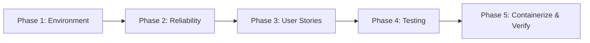

# dQul-logs — MVP Implementation Plan

> **Scope boundary:** This plan covers the **standalone `dQul-logs` microservice** only.
> It is intentionally **NOT wired into the main `dQul` application** (no module dependency,
> no shared config, no changes to the root `docker-compose.yaml`, `web/`, or `dQul/`).

---

## 1. Summary

`dQul-logs` is a Spring Boot 3.4.2 / Java 21 microservice that ingests, stores, queries, and
aggregates log events from the Data Quality Platform. Logs are accepted over HTTP, buffered
asynchronously to Kafka (`platform-logs-topic`), persisted to PostgreSQL, and exposed via a
REST API with filtering, stats, and retention purge.

Much of the scaffold already exists. This plan:
1. Audits the current state and flags the **functional gaps** that block a runnable MVP.
2. Defines the **MVP scope** (in/out).
3. Breaks the work into **5 phases → tasks** (T001…T026), each immediately executable.
4. Provides a **Requirement Mapping** table for traceability.

**Target outcome:** a microservice that runs 100% standalone via its own
`docker-compose.yaml` + `Dockerfile`, with working validation, error handling, Kafka JSON
serialization, API docs, and tests — with zero coupling to the main app.

---

## 2. Current State Assessment

| Area | Status | Notes |
|------|--------|-------|
| Spring Boot app entry point | ✅ Done | `LogsApplication.java` |
| `LogEntry` JPA entity + indexes | ✅ Done | `domain/LogEntry.java`, Flyway `V1__create_log_entries_table.sql` |
| Repository (JPA + Specifications) | ✅ Done | `repository/LogEntryRepository.java` |
| Service layer (save/query/stats/purge) | ✅ Done | `service/LogService.java` |
| REST controller (5 endpoints) | ✅ Done | `controller/LogController.java` |
| Kafka topic + consumer | ✅ Done | `config/KafkaConfig.java`, `kafka/KafkaLogConsumer.java` |
| Application config (Postgres/Flyway/Kafka) | ⚠️ Partial | Consumer deserializer set, but **producer JSON serializer missing** |
| Input validation | ❌ Missing | `spring-boot-starter-validation` not in `pom.xml`; no `@Valid` / constraints |
| Error handling | ❌ Missing | No `@RestControllerAdvice`; inconsistent error bodies (e.g. bare 404) |
| API docs | ❌ Missing | No OpenAPI/Swagger |
| Log level / category normalization | ⚠️ Weak | Strings uppercased ad-hoc; no whitelist/enum |
| Tests | ⚠️ Minimal | Only `contextLoads()`; no unit/controller/Kafka tests |
| Standalone run env | ❌ Missing | No `docker-compose.yaml`, no `Dockerfile`, `run.sh` depends on root `../.env` |
| README / env docs | ❌ Missing | No service-level README |

### Critical blocker
`LogController.ingestLog()` uses `KafkaTemplate<String, Object>` but `application.yaml` defines
**no producer value serializer**. Spring Boot defaults the producer serializer to
`StringSerializer`, so the DTO would be sent as a raw `toString()` — which the consumer's
`JsonDeserializer` cannot parse. **The ingest path will not work end-to-end until producer
JSON serialization is configured** (Task T005).

---

## 3. MVP Scope

### In scope (MVP)
- HTTP log ingestion (async via Kafka, `202 Accepted`).
- Durable persistence of ingested logs to PostgreSQL (Flyway-managed schema).
- Query logs with filters (`level`, `serviceName`, `category`, `traceId`, `search`) + pagination.
- Retrieve a single log by ID.
- Aggregate stats (totals, error rate, avg latency, by service/category).
- Purge logs older than N days.
- Input validation + consistent API error responses.
- Standalone local environment (own compose + Dockerfile + env docs).
- Tests for the core paths.

### Out of scope (post-MVP / explicitly excluded)
- Wiring into the main `dQul` app, `web/` frontend, or root compose.
- Authentication/authorization of the logs API (single-trust-boundary for now).
- Centralized observability/metrics exporters (Prometheus/Grafana).
- Dead-letter queue / retry infrastructure for Kafka failures.
- Multi-tenant isolation, partitioning/archiving strategies.
- Audit trail, RBAC, or per-tenant retention policies.

---

## 4. Technical Context

- **Language/Runtime:** Java 21, Spring Boot 3.4.2, Maven (wrapper `mvnw`).
- **Persistence:** PostgreSQL 16, Spring Data JPA/Hibernate (`ddl-auto: validate`), Flyway.
- **Messaging:** Apache Kafka (KRaft mode, no ZooKeeper) — topic `platform-logs-topic` (3 partitions).
- **Transport:** REST on port `7001` (`/api/v1/logs`).
- **Data model:** single table `log_entries` with indexes on `trace_id`, `service_name`,
  `log_level`, `timestamp`, `category`.
- **Config:** env-var driven with sensible defaults (`application.yaml`).

---

## 5. Applied Guidelines

Source: `guidelines/spring-boot-scaffolding`

- Use **JDK 21** for new Spring Boot services (LTS until 2031). ✅ already on 21.
- Include **`spring-boot-starter-validation`** for request DTO validation.
- Keep Flyway migrations as the **single source of truth** for schema (`ddl-auto: validate`).
- Use **Lombok** to reduce boilerplate. ✅ already used.
- Prefer a **multi-stage Dockerfile** for the OCI image (build with Maven, runtime on Temurin 21).
- Keep API responses consistent via a **global exception handler** and documented OpenAPI contract.

---

## 6. Implementation Steps (Phases)

### Phase 1 — Standalone Environment (Setup)
Prepares the service to run fully on its own.

- **1.1** Add missing dependencies to `pom.xml` (validation, OpenAPI, actuator).
- **1.2** Add a standalone `docker-compose.yaml` inside `dQul-logs` (Postgres + Kafka).
- **1.3** Add `.env.example` documenting all service env vars.
- **1.4** Add service `README.md`; make `run.sh` self-contained (no root `.env` dependency).

### Phase 2 — Foundational Reliability (Blocking prerequisites)
Makes the existing scaffold actually work and fail cleanly.

- **2.1** Configure **Kafka producer JSON serialization** (blocker — see §2).
- **2.2** Add **bean validation** to `LogIngestionDto` and enable `@Valid`.
- **2.3** Add a **global exception handler** with a consistent error envelope.
- **2.4** Add **OpenAPI/Swagger** docs for the logs API.
- **2.5** Normalize **log level / category** with enums/whitelist.
- **2.6** Enable **actuator health** endpoints (for containerization/readiness).

### Phase 3 — MVP User Stories (features)
Verify + harden the existing feature set, adding tests as we go.

- **US1** — Ingest log over HTTP (async, `202`) → `REQ-001`, `REQ-007`, `REQ-008`
- **US2** — Persist consumed Kafka events → `REQ-002`
- **US3** — Query/filter/search logs (paginated) → `REQ-003`
- **US4** — Fetch single log by id → `REQ-004`
- **US5** — Aggregate stats → `REQ-005`
- **US6** — Purge logs older than N days → `REQ-006`

### Phase 4 — Testing
- **4.1** Service unit tests (mocked repository).
- **4.2** Controller slice tests (MockMvc), incl. validation errors.
- **4.3** Kafka consumer test (`@EmbeddedKafka`).
- **4.4** Integration test (Testcontainers Postgres+Kafka, or H2 profile) covering
  ingest → consume → query round trip + Flyway migration.

### Phase 5 — Containerize & Verify Standalone (final)
- **5.1** Multi-stage `Dockerfile`.
- **5.2** `.dockerignore`.
- **5.3** Manual end-to-end verification checklist (curl flow).
- **5.4** **Guard rail:** explicit note/README section that this service is intentionally
  standalone and must not be wired into the main app.

---

## 7. Task Breakdown

> No project topology (G-groups) — labels omitted per guidelines. `[P]` = parallelizable.
> `[Plan:X.Y]` references the plan items above. Tests included (requested context: MVP).

### Phase 1 — Standalone Environment
- [ ] T001 [Plan:1.1] Add `spring-boot-starter-validation`, `org.springdoc:springdoc-openapi-starter-webmvc-ui` (2.x), and `spring-boot-starter-actuator` to `dQul-logs/pom.xml`
- [ ] T002 [P] [Plan:1.2] Create `dQul-logs/docker-compose.yaml` with two services: `logs-postgres` (Postgres 16, DB `dqul_logs`, port `3453:5432`, healthcheck) and `logs-kafka` (Bitnami/`apache/kafka` in KRaft mode, `9092:9092`, healthcheck), on an isolated bridge network `dqul-logs-network`
- [ ] T003 [P] [Plan:1.3] Create `dQul-logs/.env.example` documenting `DQUL_LOGS_DATABASE_URL`, `DQUL_LOGS_DATABASE_USERNAME`, `DQUL_LOGS_DATABASE_PASSWORD`, `KAFKA_BOOTSTRAP_SERVERS`, `SERVER_PORT`, `LOGS_PURGE_DEFAULT_DAYS`
- [ ] T004 [Plan:1.4] Create `dQul-logs/README.md` (overview, endpoints table, standalone run: `docker compose up -d`, `./mvnw spring-boot:run`, sample curl) and update `dQul-logs/run.sh` to source a local `./.env` if present, else rely on `application.yaml` defaults (remove hard dependency on `../.env`)

### Phase 2 — Foundational Reliability
- [ ] T005 [Plan:2.1] Add producer JSON config to `dQul-logs/src/main/resources/application.yaml` under `spring.kafka.producer`: `value-serializer: org.springframework.kafka.support.serializer.JsonSerializer`, `key-serializer: org.apache.kafka.common.serialization.StringSerializer`, and `spring.json.trusted.packages: "*"` (or `com.regisx001.dQul.logs.dto`) so `KafkaTemplate<String,Object>` serializes DTOs correctly [Source: dQul-logs/src/main/resources/application.yaml]
- [ ] T006 [Plan:2.2] Add `spring-boot-starter-validation` usage: annotate `dQul-logs/src/main/java/com/regisx001/dQul/logs/dto/LogIngestionDto.java` with `@NotBlank(message)`, `@Size(max=…)` on message/stackTrace, `@Pattern` whitelist on `logLevel` and `category`, `@Min/@Max` on `statusCode`/`executionTimeMs`
- [ ] T007 [Plan:2.3] Create `dQul-logs/src/main/java/com/regisx001/dQul/logs/common/error/ApiError.java` (timestamp, status, code, message, fieldErrors) and `GlobalExceptionHandler.java` (`@RestControllerAdvice`) handling `MethodArgumentNotValidException`, `ConstraintViolationException`, `NoResourceFoundException`/`404`, and generic `500` — returning the `ApiError` envelope consistently
- [ ] T008 [Plan:2.4] Add OpenAPI config `dQul-logs/src/main/java/com/regisx001/dQul/logs/config/OpenApiConfig.java` (info, `/api/v1/logs` tags) so docs are available at `/swagger-ui.html`; ensure `springdoc` group picks up the controller
- [ ] T009 [Plan:2.5] Add `dQul-logs/src/main/java/com/regisx001/dQul/logs/domain/LogLevel.java` and `LogCategory.java` enums (with `ALL` for querying); normalize in `LogService.saveLog` (uppercase + fallback `INFO`/`INTERNAL_LOG` as today) and use them for validation [Source: dQul-logs/src/main/java/com/regisx001/dQul/logs/service/LogService.java#saveLog]
- [ ] T010 [Plan:2.6] Enable `management.endpoints.web.exposure.include=health,info` and a readiness/liveness probe path in `application.yaml` for containerized deployment

### Phase 3 — MVP User Stories
- [ ] T011 [P] [US1] [Plan:3.1] Add `@Valid` to the `@RequestBody` in `LogController.ingestLog` so DTO constraints from T006 take effect [Source: dQul-logs/src/main/java/com/regisx001/dQul/logs/controller/LogController.java#ingestLog]
- [ ] T012 [P] [US1] [Plan:3.1] Guard the ingest payload: reject empty `message` and enforce `@Size` limits; ensure defaults (`timestamp`, `serviceName`) are applied server-side as today
- [ ] T013 [US2] [Plan:3.2] Harden `KafkaLogConsumer`: add `@RetryableTopic`/DLT note OR keep simple try/catch (already logs); ensure a null DTO is skipped, and confirm `saveLog` is `@Transactional`
- [ ] T014 [US2] [Plan:3.2] Ensure `LogService.saveLog` returns the persisted `LogEntry` and adds a unit test for default normalization (level/category/timestamp)
- [ ] T015 [US3] [Plan:3.3] Verify `LogService.queryLogs` filter behavior; add unit tests for each predicate (level, serviceName, category, traceId, search) and confirm pagination/sort (timestamp desc)
- [ ] T016 [US4] [Plan:3.4] Update `LogController.getLogById` 404 path to return the `ApiError` envelope from T007 instead of an empty body [Source: dQul-logs/src/main/java/com/regisx001/dQul/logs/controller/LogController.java#getLogById]
- [ ] T017 [US5] [Plan:3.5] Add a unit test for `LogService.getLogStats` (totals, error rate math, avg latency null-safety, by-service/by-category maps)
- [ ] T018 [US6] [Plan:3.6] Add bounds validation on the `days` parameter of `DELETE /purge` (e.g., `@Min(1) @Max(365)` or manual check) and a test for the purge cutoff

### Phase 4 — Testing
- [ ] T019 [Plan:4.1] Write `LogServiceTest` (Mockito) under `dQul-logs/src/test/java/com/regisx001/dQul/logs/service/` covering save, query, get, stats, purge
- [ ] T020 [P] [Plan:4.2] Write `LogControllerTest` (`@WebMvcTest` + MockMvc) covering ingest (incl. 400 on invalid payload), query, get-by-id (200/404), stats, purge
- [ ] T021 [P] [Plan:4.3] Write `KafkaLogConsumerTest` using `@EmbeddedKafka` to verify a JSON message on `platform-logs-topic` is persisted via `LogService`
- [ ] T022 [Plan:4.4] Write `LogsIntegrationTest` with Testcontainers (Postgres + Kafka) or an H2 test profile verifying Flyway migration + full ingest → consume → query → stats round trip

### Phase 5 — Containerize & Verify Standalone
- [ ] T023 [Plan:5.1] Create `dQul-logs/Dockerfile` (multi-stage: `maven:3.9-eclipse-temurin-21` build → `eclipse-temurin:21-jre` runtime, `EXPOSE 7001`, `ENTRYPOINT ["java","-jar", ...]`)
- [ ] T024 [P] [Plan:5.2] Create `dQul-logs/.dockerignore` (target/, .git/, *.md, .env)
- [ ] T025 [Plan:5.3] Manual E2E verification: `docker compose up -d` (logs-postgres + logs-kafka), `./mvnw spring-boot:run`, then run the curl checklist: ingest → query → get-by-id → stats → purge; confirm Swagger at `/swagger-ui.html`
- [ ] T026 [Plan:5.4] Add a "Standalone by design" note to `dQul-logs/README.md`: this service is **not** registered as a module of the main `dQul` app, does **not** appear in the root `docker-compose.yaml`, and must remain independently deployable

---

## 8. Requirement Mapping

| REQ ID | Description | Plan Items | Implementation Evidence |
|--------|-------------|------------|------------------------|
| REQ-001 | HTTP log ingestion (async, `202 Accepted`) | 3.1 | `LogController.java#ingestLog`, `KafkaConfig.java` |
| REQ-002 | Durable persistence of ingested logs | 2.1, 3.2 | `KafkaLogConsumer.java`, `LogService.java#saveLog`, Flyway `V1__create_log_entries_table.sql` |
| REQ-003 | Query/filter/search logs with pagination | 3.3 | `LogController.java#queryLogs`, `LogService.java#queryLogs`, `LogEntryRepository.java` |
| REQ-004 | Retrieve a single log by ID | 3.4 | `LogController.java#getLogById`, `LogService.java#getLogById` |
| REQ-005 | Aggregate stats (totals, error rate, avg latency, by service/category) | 3.5 | `LogService.java#getLogStats`, `LogEntryRepository` count queries, `LogStatsDto.java` |
| REQ-006 | Purge logs older than N days | 3.6 | `LogController.java#purgeLogs`, `LogService.java#purgeLogsOlderThan`, `deleteByTimestampBefore` |
| REQ-007 | Input validation on ingestion payload | 2.2, 3.1 | `LogIngestionDto.java` constraints, `@Valid` on controller |
| REQ-008 | Consistent API error responses | 2.3, 3.4 | `ApiError.java`, `GlobalExceptionHandler.java` |
| REQ-009 | Standalone runnable/deployable, not wired to main app | 1.1–1.4, 5.1–5.4 | `dQul-logs/docker-compose.yaml`, `Dockerfile`, `.env.example`, `README.md`, `application.yaml` |

---

## 9. Execution Order & Parallelism

- **Sequential dependency:** T005 (producer serialization) must land before end-to-end ingest works — do it first in Phase 2.
- **Parallelizable ([P]):** T002/T003; T011/T012; T020/T021; T024 — different files, no dependency.
- **Gate:** Phase 3 stories should only be marked done once their Phase 4 tests pass.

---

## 10. Out of Scope Reminders

- No changes to `dQul/` (main app), `web/` (frontend), or the root `docker-compose.yaml`.
- No authentication/authorization on the logs API in this MVP.
- No DLQ/retry infrastructure for Kafka failures beyond the existing error logging.
